#### Available in [English](README.md)

## Sobre
Este jogo é inspirado em uma clássica franquia de jogos de luta dos anos 90. Eu tentei portar o maior número possível de elementos originais do jogo inspiração dentro das limitações impostas pelo PICO-8. Alguns elementos deixaram de ser implementados pois cheguei no limite máximo de tokens, entretanto, estou muito satisfeito com o resultado obtido. No final da documentação está o backlog com algumas funcionalidades que, caso haja interesse, implementarei em versões futuras.

## Controles
⬅️ **andar para trás** \
➡️ **andar para frente** \
⬆️ **pular (use ⬅️ ou ➡️ para direcionar)** \
⬇️ **agachar** \
🅾️ **socar** \
❎ **chutar** \
🅾️❎ **bloquear** \
⬇️🅾️ **gancho** \
⬆️🅾️ **soco aéreo (use ⬅️ ou ➡️ para direcionar)** \
⬅️❎ **chute rodado** \
⬇️❎ **bandar** \
⬆️❎ **chute aéreo (use ⬅️ ou ➡️ para direcionar)**

## Lista de movimentos
```
🚩 Os comandos de alguns movimentos foram levemente alterados devido à quantidade de botões do PICO-8.
```
### Personagem 1
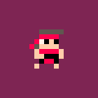

**Bola de fogo:** ➡️+➡️+🅾️ \
**Bola de fogo (aérea):** ➡️+➡️+🅾️ no ar \
**Voadora:** ➡️+➡️+❎ \
**Voadora múltipla:** segure ❎ por 3 segundos e solte

💀 **Finalização 1:** ⬇️+➡️+⬅️+⬅️+❎ \
💀 **Finalização 2:** segure 🅾️❎ e ⬇️+➡️+⬆️+⬅️+⬇️

***

### Personagem 2
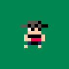

**Voadora (aérea):** ⬇️+❎ no ar \
**Arremessar o chapéu:** ⬅️+➡️+🅾️ \
**Ataque giratório:** segure 🅾️❎ \
**Teleporte:** ⬇️+⬆️

💀 **Finalização 1:** ➡️+➡️+➡️+❎ \
💀 **Finalização 2:** ⬅️+➡️+🅾️  

***

### Personagem 3
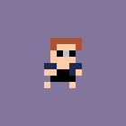

**Bola de energia:** ⬅️+⬇️+➡️+🅾️ \
**Chute especial:** ⬅️+➡️+❎ \
**Ai:** ⬇️+🅾️❎ \
**Gancho aéreo:** ⬅️+⬇️+⬅️+🅾️

💀 **Finalização 1:** ➡️+➡️+⬇️+⬆️ \
💀 **Finalização 2:** ⬇️+⬇️+➡️+➡️+🅾️

***

### Personagem 4
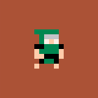

**Cuspir ácido:** ➡️+➡️+🅾️ \
**Bola de energia:** ⬅️+⬅️+🅾️ \
**Invisibilidade:** segure 🅾️❎ e ⬆️+⬆️+⬇️ \
**Deslizar:** ⬅️+🅾️❎

💀 **Finalização 1:** ⬅️+⬅️+⬇️+🅾️ \
💀 **Finalização 2:** ➡️+➡️+⬇️+❎ (deve estar invisível)

***

### Personagem 5
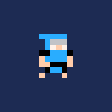

**Congelar:** ⬇️+➡️+🅾️ \
**Deslizar:** ⬅️+🅾️❎

💀 **Finalização 1:** ➡️+➡️+⬇️+❎ e depois ➡️+⬇️+➡️+➡️+🅾️ \
💀 **Finalização 2:** ⬅️+⬅️+⬇️+➡️+🅾️

***

### Personagem 6
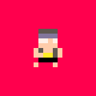

**Bola de fogo:** ⬅️+⬅️+🅾️

#### Transformações
**Personagem 1:** ⬅️+➡️+➡️+🅾️❎ \
**Personagem 2:** ⬅️+⬇️+⬅️+❎ \
**Personagem 3:** ⬅️+⬅️+⬇️+🅾️ \
**Personagem 4:** segure 🅾️❎ e ⬆️+⬇️+⬇️ \
**Personagem 5:** ➡️+⬇️+➡️+🅾️ \
**Personagem 6:** você já é o personagem 6 😅 \
**Personagem 7:** 🅾️❎+🅾️❎+🅾️❎ \
**Personagem 8:** ⬇️+➡️+⬅️+❎ \
**Personagem 9:** segure 🅾️ por 3 segundos \
**Personagem 10:** ⬇️+⬇️+❎ \
**Personagem 11:** segure 🅾️❎ e ⬆️+⬆️ \
**Personagem 12:** ⬇️+⬅️+➡️+❎

💀 **Finalização 1:** segure ❎ por 2 segundos \
💀 **Finalização 2:** segure 🅾️❎ e ⬆️+⬇️+⬆️ \
💀🐯 **Finalização 3:** segure 🅾️ por 4 segundos

***

### Personagem 7
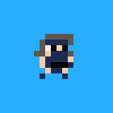

**Rajada de vento:** ⬅️+⬅️+⬅️+🅾️ \
**Arremessar o leque:** ➡️+➡️+🅾️ \
**Arremessar o leque (aéreo):** ➡️+➡️+🅾️ no ar \
**Soco voador:** ➡️+⬇️+⬅️+🅾️

💀 **Finalização 1:** 🅾️❎+🅾️❎+🅾️❎+❎ \
💀 **Finalização 2:** ➡️+➡️+⬇️+➡️+❎

***

### Personagem 8
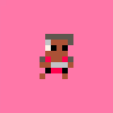

**Quebrar as costas (aéreo):** 🅾️❎ quando os dois personagens estiverem no ar \
**Onda de energia:** ➡️+⬇️+⬅️+❎ \
**Agarrão:** ➡️+➡️+🅾️ \
**Socão no chão:** segure ❎ por 3 segundos

💀 **Finalização 1:** 🅾️❎+🅾️❎+🅾️❎+🅾️❎+🅾️ \
💀 **Finalização 2:** ➡️+➡️+➡️+🅾️

***

### Personagem 9
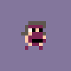

**Rolagem especial:** ⬅️+⬅️+⬇️+❎ \
**Arremessar sai:** segure 🅾️ por 2 segundos \
**Arremessar sai (aéreo):** segure 🅾️ por 2 segundos e solte no ar \
**Chute teleporte:** ➡️+➡️+❎

💀 **Finalização 1:** segure ❎ por 3 segundos \
💀 **Finalização 2:** ➡️+⬅️+➡️+🅾️

***

### Personagem 10
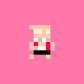

**Arremessar faísca:** ⬇️+⬅️+🅾️ \
**Punhalada múltipla:** ⬅️+⬅️+⬅️+🅾️

💀 **Finalização 1:** ⬅️+⬅️+⬅️+⬅️+🅾️ \
💀 **Finalização 2:** ⬅️+➡️+⬇️+➡️+🅾️

***

### Personagem 11
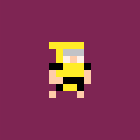

**Arremessar kunai:** ⬅️+⬅️+🅾️ \
**Tesoura:** ➡️+⬇️+⬅️+❎ \
**Soco teleporte:** ⬇️+⬅️+🅾️

💀🔥 **Finalização 1:** segure 🅾️❎ e ⬆️+⬆️ \
💀 **Finalização 2:** ⬇️+➡️+➡️+➡️+🅾️

***

### Personagem 12
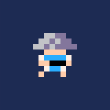

**Eletrocutar:** segure 🅾️ por 3 segundos \
**Arremesso voador:** ⬅️+⬅️+➡️ \
**Lançar raio:** ⬇️+➡️+🅾️ \
**Teleporte:** ⬇️+⬆️

💀 **Finalização 1:** segure ❎ por 4 segundos \
💀 **Finalização 2:** segure 🅾️ por 4 segundos 

***

### Backlog
- [ ] Vs CPU
- [ ] Agarrões
- [ ] Outros tipos de finalização
- [ ] Chefe secundário
- [ ] Particulas nos projéteis
- [ ] Tela de próximo combate
- [ ] Mais cenários
- [ ] Lutas com personagens secretos
- [ ] Movimentos especiais faltando

### Known bugs
- [ ] Movimento de teleporte podem apresentar comportamentos inesperados quando algum dos personagens estiver posicionado no limite da tela (qualquer lado)